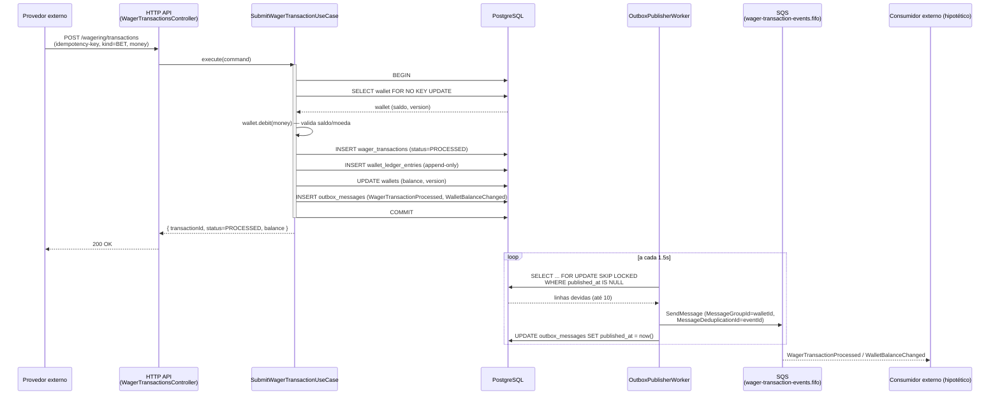
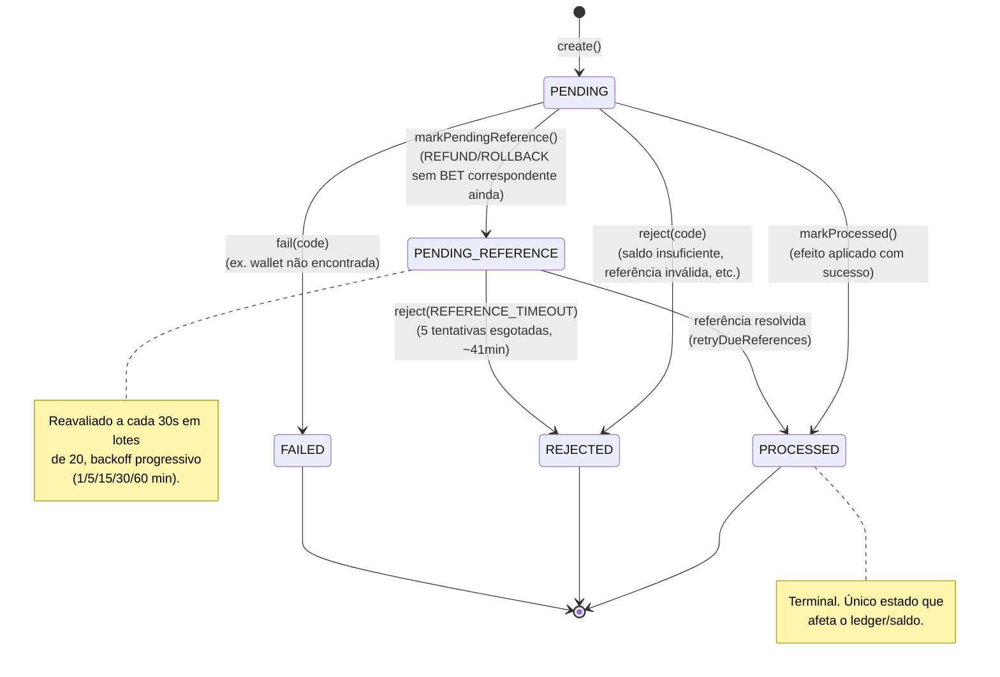
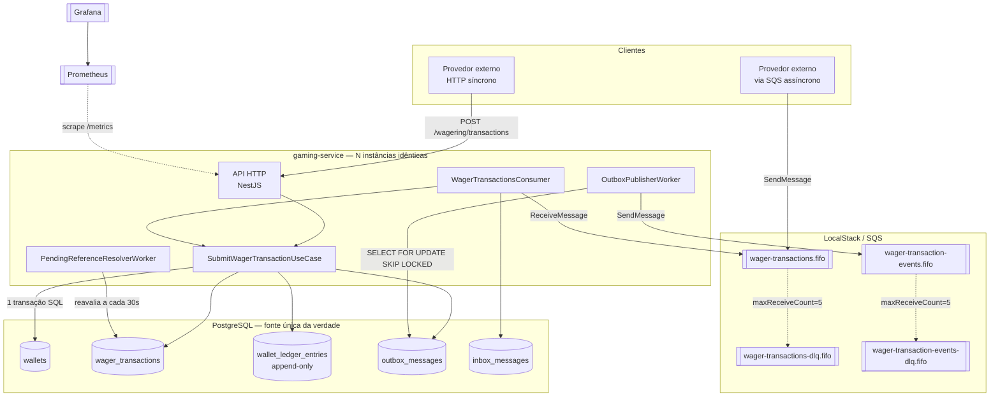

# Arquitetura — gaming-service

Este documento consolida as decisões técnicas tomadas ao longo das 8 etapas de implementação (ver `../planejamento/*.md` para o plano original e `../ANALISE.md` para o histórico completo de revisão). Ele não reinventa nada: descreve o que foi de fato construído e por quê, incluindo os pontos em que a implementação divergiu do plano inicial com justificativa própria.

## Índice

1. [Autenticação](#1-autenticação)
2. [ORM e persistência](#2-orm-e-persistência)
3. [Concorrência](#3-concorrência)
4. [Idempotência](#4-idempotência)
5. [Outbox / Inbox](#5-outbox--inbox)
6. [Taxonomia de `FailureCode`](#6-taxonomia-de-failurecode)
7. [`Money`](#7-money)
8. [Diagramas](#8-diagramas)
9. [Trade-offs assumidos e o que ficou de fora](#9-trade-offs-assumidos-e-o-que-ficou-de-fora)
10. [Resultado do teste de carga](#10-resultado-do-teste-de-carga)

---

## 1. Autenticação

REQUISITOS.md, seção 2, vale **0 dos 100 pontos** e explicitamente permite não implementar, desde que a decisão seja documentada e o ponto de extensão fique explícito no código. Essa é a decisão tomada aqui (fechada em `ANALISE.md`, Adendo 1): **autenticação é um no-op deliberado**, não uma lacuna esquecida.

- `NoOpAuthGuard` (`src/shared/auth/no-op-auth.guard.ts`) implementa `CanActivate` e sempre retorna `true`. É o único guard de autenticação registrado hoje.
- `ProviderIdentityPort` (`src/shared/auth/provider-identity.port.ts`) é a porta que separaria "quem está autenticado" de "qual `providerId` o caso de uso deve usar". `NoOpProviderIdentityAdapter` implementa essa porta retornando sempre `undefined` — o `providerId` usado nas transações vem do corpo da requisição, não de um token.
- O controller (`WagerTransactionsController`) já injeta `PROVIDER_IDENTITY_PORT` e chama `currentProviderId()` no fluxo de submissão, mesmo hoje sem usar o retorno para nada crítico — o ponto de chamada existe exatamente onde a substituição por uma implementação real entraria, sem precisar tocar no use case.

**Desenho que seria adotado em produção** (não implementado, apenas descrito, como o enunciado permite):

- Um Identity Provider externo compatível com OIDC — Keycloak ou Zitadel, ambas citadas no enunciado — emitindo JWTs para cada provedor de apostas.
- Um `AuthGuard` real substituindo o `NoOpAuthGuard`, validando assinatura/expiração do JWT na borda (via `JwksClient` ou biblioteca equivalente) e anexando os claims validados à requisição.
- Uma implementação real de `ProviderIdentityPort` (ex. `JwtProviderIdentityAdapter`) traduzindo os claims validados (ex. `sub`, ou uma claim customizada `provider_id`) para o `providerId` que os casos de uso já esperam — sem que `SubmitWagerTransactionUseCase` precise saber que a fonte da identidade mudou.
- A troca seria feita inteiramente na camada de infraestrutura (`AuthModule`), trocando os providers do binding do Nest (`{ provide: PROVIDER_IDENTITY_PORT, useClass: JwtProviderIdentityAdapter }`) — nenhuma mudança de contrato no domínio ou na aplicação.

## 2. ORM e persistência

**TypeORM** foi a escolha (Prisma está explicitamente fora de escopo pelo enunciado).

Motivos:

- Suporte de primeira classe a `QueryRunner`/`EntityManager` transacional com controle explícito de modo de lock por linha (`{ lock: { mode: "for_no_key_update" } }`), que é o mecanismo central da estratégia de concorrência (seção 3). Bibliotecas mais "leves" ou query builders puros exigiriam escrever esse controle manualmente sem ganho real.
- Migrations imperativas em SQL puro dentro de `MigrationInterface` (`src/database/migrations/*.ts`) — dá controle total sobre tipos de coluna (`numeric(19,2)`, `timestamptz`), índices parciais (`UNIQUE ... WHERE status = 'PROCESSED'`) e triggers de banco (append-only do ledger), que um ORM mais opinativo esconderia ou tornaria difícil de expressar.
- Separação limpa entre entidade de persistência (`*.entity.ts`) e modelo de domínio (`src/**/domain/*.ts`), com um `Mapper` dedicado por agregado (`WalletMapper`, `WagerTransactionMapper`, `OutboxMessageMapper`, `InboxMessageMapper`) — o TypeORM nunca vaza para dentro do domínio, que permanece POJO/classes puras sem decorators.

Como a transação foi implementada: cada caso de uso que produz efeito financeiro (`SubmitWagerTransactionUseCase.execute`) roda **uma única transação Postgres** (`dataSource.transaction(...)`), dentro da qual: lock pessimista da wallet, leitura/validação de referência, escrita da `wager_transaction`, escrita do `wallet_ledger_entries`, atualização do saldo da `wallet` e `INSERT` do evento de outbox acontecem atomicamente. O outbox nunca é gravado fora dessa transação (ver seção 5).

## 3. Concorrência

**Estratégia escolhida: locking pessimista** (`SELECT ... FOR NO KEY UPDATE` na linha da `wallet`), não otimista com retry.

Por que pessimista, dado o timebox de 2 dias:

- O enunciado (seção 8) definiu a unidade de concorrência como a `walletId` e exige correção sob disputa real de saldo — não apenas "não corromper", mas produzir exatamente o resultado determinístico do cenário obrigatório (uma `PROCESSED`, uma `REJECTED`, saldo final exato, um único lançamento de débito).
- Optimistic locking com retry (via coluna `version` e `UPDATE ... WHERE version = :v`) exigiria decidir, sob timebox curto, uma política de retry com backoff, um limite de tentativas e uma forma de comunicar "esgotou retries" ao chamador de forma consistente com o resto da taxonomia de falha — mais superfície de decisão e mais superfície de bug para o tempo disponível.
- Pessimista com `SELECT FOR UPDATE`/`FOR NO KEY UPDATE` dá correção determinística e imediata: a segunda transação simplesmente espera a primeira liberar a linha, sem produzir um "conflito" que precise de retry explícito no caminho feliz — o custo é serializar escritas na mesma wallet, que é aceitável porque a unidade de concorrência já é por wallet (wallets diferentes continuam paralelas).

**Achado de concorrência real e correção aplicada** (histórico completo em `ANALISE.md`, Adendo 6): a primeira versão usava `pessimistic_write` (`FOR UPDATE`) no lock da wallet. O `INSERT` da `wager_transaction`, por ter uma FK para `wallets.id`, faz o Postgres adquirir implicitamente um lock `FOR KEY SHARE` na linha da wallet **antes** do `SELECT FOR UPDATE` explícito do código. `FOR KEY SHARE` é compartilhável entre transações, mas **conflita com `FOR UPDATE`** — com 3 ou mais transações concorrentes na mesma wallet, formava-se um ciclo de espera genuíno e o Postgres derrubava uma delas com deadlock real (`40P01`), reproduzido ao vivo de forma determinística (10/10 com pool de conexões "quente"). A correção de causa raiz foi trocar `FOR UPDATE` por **`FOR NO KEY UPDATE`**, que não conflita com `FOR KEY SHARE` — a aplicação nunca altera a PK da wallet, então `FOR NO KEY UPDATE` dá a mesma garantia de exclusão mútua sem o conflito estrutural. Reverificado ao vivo com concorrência 2/5/10 em pool quente: 0 deadlocks em todos os casos após a correção.

**Defesa em profundidade**: um índice único parcial no banco —

```sql
CREATE UNIQUE INDEX "UQ_wager_transactions_reference_kind_processed"
  ON "wager_transactions" ("reference_transaction_id", "kind")
  WHERE "status" = 'PROCESSED' AND "kind" IN ('REFUND', 'ROLLBACK')
```

— garante, no próprio schema, que uma `BET` nunca pode ser revertida (`REFUND`/`ROLLBACK`) duas vezes, mesmo se algum caminho de código no futuro esquecer de checar isso antes de commitar. Isso não é a proteção principal (o lock pessimista já serializa o acesso), é uma rede de segurança independente do código de aplicação.

**Rede de segurança adicional — retry em erro transitório**: `isTransientTransactionError` reconhece `40P01` (deadlock) e `40001` (serialization failure) tanto em `error.code` quanto em `driverError.code`, e `SubmitWagerTransactionUseCase.runInTransaction` reexecuta a transação inteira (não só a query que falhou) até 8 vezes, com backoff linear + jitter (`20ms * tentativa + até 40ms aleatório`). Rebaixado explicitamente de "correção principal" para "rede de segurança" depois que a causa raiz foi eliminada estruturalmente — hoje qualquer disparo desse retry é logado em nível `warn` com `walletId`/código do erro, sinalizando uma fonte de deadlock ainda não mapeada, não um evento silencioso e esperado.

## 4. Idempotência

Dois mecanismos complementares, ambos apoiados em **constraint única de banco**, nunca em estado em memória:

- **Idempotency key HTTP** (`idempotency-key` header, obrigatório via `IdempotencyKeyGuard`): `wager_transactions.idempotency_key` tem uma unique constraint. Uma resubmissão com a mesma chave e o mesmo payload (comparado via `payloadHash`, um SHA-256 do payload canonicalizado — ver `canonicalJsonStringify`/`sha256Hex`) retorna o resultado já processado (`idempotentReplay: true`) sem reprocessar nada. Mesma chave com payload diferente é rejeitada como `IDEMPOTENCY_CONFLICT` — não é tratada como replay silencioso.
- **Inbox por mensagem SQS** (`(consumer_name, message_id)` como chave primária composta, `PK_inbox_messages`): usado apenas no caminho assíncrono (consumer). Como a entrega SQS é *at-least-once*, a mesma mensagem pode chegar mais de uma vez; a claim do inbox acontece num `SAVEPOINT` dentro da **mesma transação** do efeito de negócio — se o commit falhar depois do `INSERT` no inbox, a transação inteira reverte (inbox incluído), então nunca há inbox "confirmado" sem o efeito correspondente, nem o oposto.

Em ambos os casos, o SHA-256 do payload é comparado, não o payload bruto — barato de armazenar e comparar, e suficiente para detectar payload divergente sob a mesma chave.

## 5. Outbox / Inbox

**Por que o outbox nunca publica antes do commit**: publicar um evento de integração antes do commit da transação de negócio arrisca anunciar um fato que pode nunca ter acontecido (rollback depois da publicação) — a lista de falhas eliminatórias do desafio (seção 14) trata isso como eliminatório. A solução: `enqueue()` apenas insere a linha em `outbox_messages` (`OutboxMessageEntity`) **dentro da mesma transação SQL** do efeito de negócio (débito/crédito, mudança de status). Um worker separado (`OutboxPublisherWorker`) é o único processo que efetivamente fala com o SQS, e só lê linhas cuja transação já commitou (por definição — ele lê de uma tabela, não de um buffer em memória).

**Publicação concorrente sem duplicar nem perder**: `OutboxPublisherWorker` roda em loop (`POLL_INTERVAL_MS = 1500`) e, a cada ciclo, abre uma transação, seleciona até `BATCH_SIZE = 10` linhas não publicadas e já devidas (`published_at IS NULL AND (next_attempt_at IS NULL OR next_attempt_at <= now)`, ordenadas por `occurred_at ASC`) com `SELECT ... FOR UPDATE SKIP LOCKED`, publica cada uma via `SendMessageCommand` (com `MessageDeduplicationId = message.id` e `MessageGroupId = message.aggregateId`, preservando ordem por wallet no FIFO) e marca `published_at`. `SKIP LOCKED` é o que permite **múltiplas instâncias do worker rodarem ao mesmo tempo contra a mesma tabela** sem duas delas pegarem a mesma linha — verificado ao vivo (Adendo 8): 24 eventos reais publicados por 2 workers concorrentes, 0 duplicatas, 0 perdas.

**Backoff e TTL de `PENDING_REFERENCE`**: quando um `REFUND`/`ROLLBACK` chega antes da `BET` que referencia, a transação vai para `PENDING_REFERENCE` e é reavaliada por `PendingReferenceResolverWorker` a cada 30s, em lotes de 20 (`retryDueReferences(now, 20)`), ordenado pela mais antiga primeiro. Os atrasos entre tentativas são progressivos e definidos em `REFERENCE_RECHECK_DELAYS_MS`:

```
[60_000, 300_000, 900_000, 1_800_000, 3_600_000]  // 1min, 5min, 15min, 30min, 1h
```

5 tentativas (`MAX_REFERENCE_CHECK_ATTEMPTS = REFERENCE_RECHECK_DELAYS_MS.length`), soma total ≈ 41 minutos antes de desistir. Justificativa dos valores: a progressão geométrica (aprox. ×5 a cada passo, com o último passo dobrando) cobre tanto o caso comum (mensagens fora de ordem por poucos segundos/minutos, resolvido já na 1ª ou 2ª tentativa) quanto uma falha de infraestrutura mais longa do provedor de origem (até ~40min), sem manter uma transação "pendurada" indefinidamente nem gastar um lote inteiro do worker em tentativas certamente inúteis logo de cara. Esgotadas as 5 tentativas, a transação é `REJECTED` com `failureCode = REFERENCE_TIMEOUT` e um evento `WagerTransactionRejected` é publicado — o mesmo caminho de rejeição usado em qualquer outra falha de negócio, sem caso especial.

**Fila de eventos de saída** (decisão registrada em `ANALISE.md`, Adendo 7 — o plano original não definia para onde o outbox publicava): `wager-transaction-events.fifo` + `wager-transaction-events-dlq.fifo`, dedicada, separada da fila de comandos de entrada (`wager-transactions.fifo`) para não misturar schema/semântica de entrada e saída na mesma fila. FIFO com `ContentBasedDeduplication`, `MessageGroupId = walletId`, redrive para DLQ após 5 tentativas — mesmo padrão já usado na fila de comandos, sem reinventar uma segunda convenção.

**Consumer de comandos e SIGTERM**: `WagerTransactionsConsumer` faz long-polling (`WaitTimeSeconds = 20`), processa uma mensagem por vez via `SubmitWagerTransactionUseCase` (reaproveitando o inbox para dedupe), e só chama `DeleteMessageCommand` (ack) **depois** do commit da transação de negócio. Erros de negócio (`DomainHttpException`) são confirmados (ack) — não é um erro de infraestrutura, é uma rejeição legítima já persistida. Erros transitórios do Postgres (`40P01`/`40001`) reagendam a visibilidade da mensagem com backoff (`5s, 15s, 30s, 60s, 120s`, escalando por `ApproximateReceiveCount`) em vez de deixar a mensagem invisível até o timeout padrão. `onModuleDestroy` seta uma flag de parada e aborta o `ReceiveMessageCommand` em voo via `AbortController`, dando ao Nest (`enableShutdownHooks()`) uma janela para drenar a mensagem em processamento antes do `SIGTERM` virar `SIGKILL` do orquestrador.

**Crash entre commit e ack, e recuperação por redelivery**: para tornar esse cenário testável de forma determinística (em vez de depender de matar o processo no timing certo), existe um gatilho de teste explícito — `WAGER_CONSUMER_CRASH_AFTER_COMMIT=1` faz o consumer chamar `process.exit(1)` logo após o commit da transação e antes do `ack`. A mensagem SQS permanece "em voo" e volta a ficar visível após o `VisibilityTimeout` expirar; uma nova instância (ou a mesma, reiniciada) a recebe de novo. Como o efeito de negócio já foi commitado e o inbox já reivindicou aquele `messageId`, o reprocessamento é idempotente: a segunda tentativa cai no caminho de replay do inbox, não duplica o débito/crédito, e a mensagem é finalmente confirmada. Verificado ao vivo com `SIGKILL` em pleno processamento e reconciliação real depois (`concorrencia-multiprocesso.spec.ts`, cenário 5).

## 6. Taxonomia de `FailureCode`

```
VALIDATION_ERROR                  Payload da requisição falhou validação de schema/formato.
IDEMPOTENCY_KEY_MISSING           Header idempotency-key ausente numa rota que o exige.
IDEMPOTENCY_CONFLICT              Mesma idempotency-key usada com payload diferente do já processado.
INVALID_CURSOR                    Cursor de paginação do ledger malformado ou inválido.
WALLET_ALREADY_EXISTS             Tentativa de criar uma wallet com um id já existente.
WALLET_NOT_FOUND                  walletId referenciado não existe.
TRANSACTION_NOT_FOUND             Transação consultada por id/externalTransactionId não existe.
CURRENCY_MISMATCH                 Moeda da transação diverge da moeda da wallet ou da referência.
INSUFFICIENT_BALANCE              BET/débito recusado por saldo insuficiente.
REFERENCE_NOT_FOUND               (reservado) referência explicitamente não encontrada, fora do fluxo PENDING_REFERENCE.
REFERENCE_MISMATCH                Referência existe, mas playerId/walletId/roundId/money não batem com a transação.
REVERSAL_WOULD_OVERDRAW            ROLLBACK deixaria o saldo negativo.
REFERENCE_ALREADY_USED            REFUND/ROLLBACK já foi aplicado antes para essa mesma referência+kind.
REFERENCE_WRONG_KIND              Referência aponta para uma transação de kind incompatível (ex. REFUND de um REFUND).
REFERENCE_TIMEOUT                 PENDING_REFERENCE esgotou as tentativas de recheck sem a referência aparecer.
TRANSIENT_INFRASTRUCTURE_FAILURE  Falha de infraestrutura considerada transitória (retentável).
UNEXPECTED_ERROR                  Erro não mapeado especificamente, mas tratado.
INTERNAL_ERROR                    Falha interna genérica não classificada.
```

Cada rejeição de negócio (`WagerTransaction.reject(code)`/`.fail(code)`) carrega exatamente um desses códigos, tanto na resposta HTTP (`DomainHttpException` correspondente) quanto no evento `WagerTransactionRejected` publicado no outbox — o provedor externo recebe o mesmo código pelos dois canais (síncrono e assíncrono), o suficiente para decidir se reenvia (`REFERENCE_TIMEOUT`, erros transitórios), corrige o payload (`VALIDATION_ERROR`, `CURRENCY_MISMATCH`, `REFERENCE_MISMATCH`) ou desiste (`INSUFFICIENT_BALANCE`, `REFERENCE_ALREADY_USED`).

## 7. `Money`

**Representação interna**: não é `number`/`float`/`double` (eliminaria o projeto pela lista de falhas eliminatórias) nem `bigint` de centavos (a sugestão original do plano). A escolha final foi **`decimal.js`**, com uma instância clonada e configurada especificamente para este domínio:

```ts
const MoneyDecimal = Decimal.clone({
  precision: 40,
  rounding: Decimal.ROUND_HALF_UP,
  toExpNeg: -SCALE,   // SCALE = 2
  toExpPos: 30,
});
```

Por que essa escolha em vez de `bigint` de centavos:

- `bigint` de centavos exige que **todo** ponto de entrada/saída (parsing de request, serialização de resposta, leitura/escrita do Postgres) faça a conversão cêntimos↔decimal manualmente e de forma consistente — mais superfície de erro num timebox curto, para um ganho de performance que este domínio não precisa (throughput medido no teste de carga: ~489 req/s, muito longe de onde aritmética de `bigint` faria diferença).
- `decimal.js` com `precision: 40` dá margem larga para operações intermediárias (soma de vários lançamentos, por exemplo) sem perder precisão antes do arredondamento final, e `ROUND_HALF_UP` fixa uma regra de arredondamento determinística e documentada, em vez de depender do comportamento IEEE-754 do `number`.
- `toExpNeg: -2` combinado com `MONEY_AMOUNT_PATTERN = /^\d+\.\d{2}$/` (`money-format.ts`) garante que qualquer valor que entra por `Money.from()` já está estritamente no formato `"123.45"` — duas casas decimais, sem notação científica, validado na borda antes de virar `Decimal`.
- No banco, a coluna é `numeric(19,2)` (não `float`/`double precision`) em todas as tabelas que guardam valor monetário (`wallets.balance_value`, `wager_transactions.money_value`, `wallet_ledger_entries.*_value`) — o Postgres nunca vê um `Money` como ponto flutuante, reforçando a mesma garantia na camada de persistência.
- Na borda HTTP/mensageria, `Money` sempre serializa como `{ amount: "123.45", currency: "BRL" }` (`toJSON()`), nunca como número — o mesmo formato de string entra e sai, sem uma etapa de conversão numérica em nenhum lugar do sistema.

`currency` é validada contra `CURRENCY_CODE_PATTERN = /^[A-Z]{3}$/` (ISO 4217-like, 3 letras maiúsculas) e toda operação (`add`/`subtract`/`isLessThan`/`equals`) checa igualdade de moeda primeiro, lançando `CurrencyMismatchError` — não existe conversão de câmbio implícita em lugar nenhum.

## 8. Diagramas

### 8.1 Sequência — fluxo `BET` completo



### 8.2 Máquina de estados — `WagerTransactionStatus`



### 8.3 Componentes



## 9. Trade-offs assumidos e o que ficou de fora

Honestamente, dentro do timebox de 2 dias:

- **Double-entry bookkeeping completo** (contrapartida em uma conta "house"/"casa" para cada lançamento) não foi implementado. O `wallet_ledger_entries` é auditável e append-only, mas de entrada única (só a perspectiva da wallet do jogador) — suficiente para provar `wallet.balance == saldo reconstruído pelo ledger` (a invariante exigida), mas não para uma contabilidade formal de dupla entrada com a casa.
- **OpenTelemetry/tracing distribuído** não foi implementado — explicitamente opcional pela seção 12. O que existe (correlationId/causationId propagados via `AsyncLocalStorage` e presentes em todo log estruturado) cobre o caso de uso prático de "seguir uma transação através dos logs", mas não substitui spans/traces reais entre serviços.
- **Autenticação real** não foi implementada — decisão fechada e justificada na seção 1 acima, vale 0 pontos pelo enunciado.
- **Purga/retenção de outbox publicado**: linhas de `outbox_messages` já publicadas nunca são removidas ou arquivadas. Para este desafio isso é inofensivo (volume baixo, sem requisito de retenção), mas cresceria indefinidamente em produção sem uma rotina de limpeza — não implementada.
- **Higiene do ambiente de desenvolvimento compartilhado**: os testes de integração de outbox/pending-reference (`mensageria-outbox-inbox.spec.ts`) assumem implicitamente um banco/fila "razoavelmente limpos". Isso é verdade em CI efêmero, mas já causou falsos-negativos neste mesmo ambiente de desenvolvimento de longa duração quando poluído por verificações manuais/testes de carga repetidos (histórico completo em `ANALISE.md`, Adendo 9 e as duas correções seguintes). O teste foi corrigido para tolerar ruído da fila de eventos (deletar mensagens estranhas durante a varredura, convergir por timeout em vez de orçamento fixo de tentativas), mas a recomendação de isolar esse teste com schema/fila dedicados, ou truncar o backlog periodicamente, permanece como item de robustez para um próximo ciclo, não como pendência bloqueante desta entrega.
- **Coleção Postman/Insomnia** (`docs/postman_collection.json`): item auto-imposto no plano da etapa 2 (não exigido por `REQUISITOS.md`, que não pontua isso), ainda não gerado. Não bloqueia nenhum dos 100 pontos da avaliação oficial (a seção 9 do próprio `REQUISITOS.md` já documenta contratos e exemplos de payload por endpoint), mas fica registrado aqui como item pendente de baixo risco para follow-up.
- **Cobertura de teste de unidade dos casos de uso "periféricos"**: `SubmitWagerTransactionUseCase` tem cobertura de integração extensa; `CreateWalletUseCase`, `GetWalletUseCase`, `GetWalletLedgerUseCase`, `GetWagerTransactionByIdUseCase`/`ByExternalIdUseCase` têm cobertura mais fina (a maior parte da complexidade e do risco do desafio está concentrada no caso de uso central, e o tempo foi alocado de acordo).

## 10. Resultado do teste de carga

Teste de carga hand-rolled (não é um diferencial dispensado — foi de fato executado e medido), `scripts/load-test.ts`, exposto como `bun run test:load`. Metodologia: N wallets criadas com saldo inicial alto, C "providers" concorrentes disparando requisições HTTP reais contra a API por uma janela de tempo fixa, sorteando `BET`/`WIN`/`REFUND` com pesos 6/2/2 e valores aleatórios entre `1.00` e `50.00`; métricas do `/metrics` são lidas antes e depois para calcular o delta de conflitos de lock/retries/divergências durante a janela.

**Ambiente**: gaming-service (1 instância) + Postgres + LocalStack SQS locais, todos em containers Docker na mesma máquina de desenvolvimento (sem isolamento de recursos/benchmark de laboratório — os números abaixo caracterizam comportamento, não são um benchmark de capacidade).

**Execução registrada** (`LOAD_TEST_WALLETS=10 LOAD_TEST_CONCURRENCY=10 LOAD_TEST_DURATION_SECONDS=8`):

| Métrica | Valor |
|---|---|
| Requisições totais | 3921 em 8.0s |
| Throughput | ~489 req/s |
| Sucesso (2xx) | 97.1% |
| Latência p50 | 18.0 ms |
| Latência p95 | 38.5 ms |
| Latência p99 | 55.4 ms |
| Conflitos de lock / retries / divergências de reconciliação na janela | 0 |

Não há meta de RPS a bater (o enunciado é explícito sobre isso); o objetivo do experimento era caracterizar o comportamento sob concorrência real com poucas wallets "quentes" disputadas por muitos providers simultâneos — cenário estruturalmente parecido com o cenário obrigatório da seção 8, só que sustentado ao longo do tempo em vez de dois disparos isolados. Zero conflitos de lock registrados nessa janela específica é consistente com a correção estrutural da seção 3 (troca para `FOR NO KEY UPDATE`), não com ausência de disputa real — 10 providers contra 10 wallets garante colisões frequentes na mesma linha.
